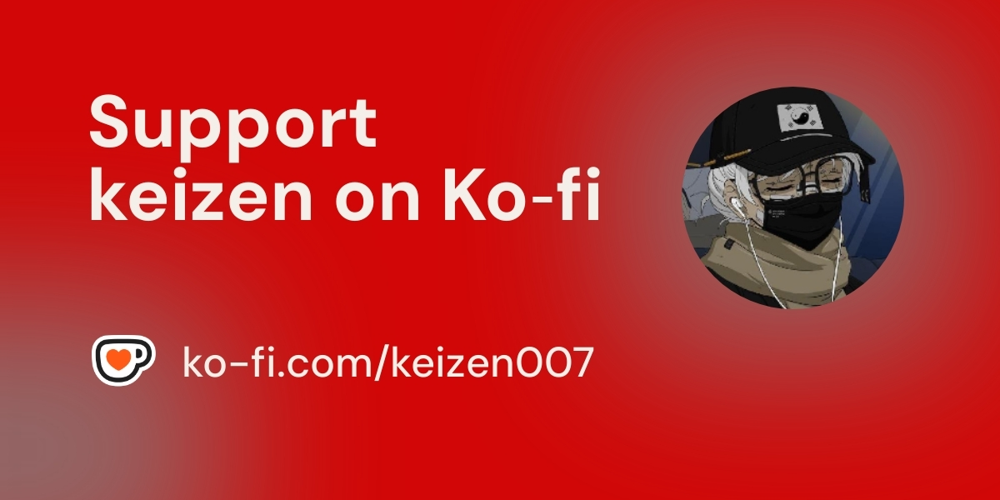

⠀⠀⠀⠀⠀⠀⠀⠀⠀⠀⠀⠀⠀⠀⠀⠀⠀⠀⢀⣀⣀⣀⣀⣀⣠⣼⠂⠀⠀⠀⠀⠙⣦⢀⠀⠀⠀⠀⠀⢶⣤⣀⣀⣀⣀⣀⡀⠀⠀⠀⠀⠀⠀⠀⠀⠀⠀⠀⠀⠀⠀⠀⠀⠀⠀
⠀⠀⠀⠀⠀⠀⠀⠀⠀⠀⠀⠀⠀⢀⣠⣴⣶⣿⣿⣿⣿⣿⣿⣿⣿⠷⢦⠀⣹⣶⣿⣦⣿⡘⣇⠀⠀⠀⢰⠾⣿⣿⣿⣟⣻⣿⣿⣿⣷⣦⣄⡀⠀⠀⠀⠀⠀⠀⠀⠀⠀⠀⠀⠀⠀
⠀⠀⠀⠀⠀⠀⠀⠀⠀⠀⢀⣤⣾⣿⣿⣿⣿⣿⣿⣿⣿⣿⡟⠀⠀⠀⠀⢺⣿⣿⣿⣿⣿⣿⣿⣆⠀⠀⠀⠀⠀⠀⢹⣿⣿⣿⣿⣿⣿⣿⣿⣿⣷⣦⡀⠀⠀⠀⠀⠀⠀⠀⠀⠀⠀
⠀⠀⠀⠀⠀⠀⠀⠀⢀⣴⢟⣥⣿⣿⣿⣿⣿⣿⣿⣿⣿⣿⡇⠀⠀⠀⠀⢻⣿⣿⡏⢹⣿⣿⣿⣿⠀⠀⠀⠀⠀⠀⠀⣿⣿⣿⣿⣿⣿⣿⣿⣿⣿⣮⣝⢷⣄⠀⠀⠀⠀⠀⠀⠀⠀
⠀⠀⠀⠀⠀⠀⠀⣴⣿⣿⣿⣿⣿⣿⣿⣿⣿⡿⢛⣿⣿⣿⡇⠀⠀⠀⠀⠛⣿⣿⣷⡀⠘⢿⣧⣻⡷⠀⠀⠀⠀⠀⠀⣿⣿⣿⣟⢿⣿⣿⣿⣿⣿⣿⣿⣿⣝⢧⡀⠀⠀⠀⠀⠀⠀
⠀⠀⠀⠀⠀⢠⣾⣿⠟⣡⣾⣿⣿⣧⣿⡿⣋⣴⣿⣿⣿⣿⣧⠀⠀⠀⠀⠀⢻⣿⣿⣿⣶⡄⠙⠛⠁⠀⠀⠀⠀⠀⢸⣿⣿⣿⣿⣷⣝⢻⣿⣟⣿⣿⣷⣮⡙⢿⣽⣆⠀⠀⠀⠀⠀
⠀⠀⠀⠀⢀⡿⢋⣴⣿⣿⣿⣿⣿⣼⣯⣾⣿⣿⡿⣻⣿⣿⣿⣦⠀⠀⠀⠀⢀⣹⣿⣿⣿⣿⣶⣤⠀⠀⠀⠀⠀⣰⣿⣿⣿⣿⠻⣿⣿⣿⣮⣿⣿⣿⣿⣿⣿⣦⡙⢿⣇⠀⠀⠀⠀
⠀⠀⠀⣠⡏⣰⣿⣿⡿⢿⣿⣿⣿⣿⣿⣿⡿⢋⣼⣿⣿⣿⣿⣿⣷⡤⠀⣠⣿⣿⣿⣿⣿⣿⣿⣿⣷⣄⠀⢠⣾⣿⣿⣿⣿⣿⣷⡜⢿⣿⣿⣿⣿⣿⣿⡿⠿⣿⣿⣦⡙⣦⠀⠀⠀
⠀⠀⣰⢿⣿⣿⠟⠋⣠⣾⣿⣿⣿⣿⣿⠛⢡⣾⡿⢻⣿⣿⣿⣿⣿⣿⣿⣿⡿⠋⠻⣿⡟⣿⣿⣿⠻⢿⣿⣿⣿⣿⣿⣿⣿⣟⠻⣿⣆⠙⢿⣿⣿⣿⣿⣿⣦⡈⠻⣿⣿⣟⣧⠀⠀
⠀⣰⢣⣿⡿⠃⣠⡾⠟⠁⠀⣸⣿⡟⠁⢀⣿⠋⢠⣿⡏⣿⣿⣿⣿⣿⢿⠁⢀⣠⣴⢿⣷⣿⣿⣿⠀⠀⠽⢻⣿⣿⣿⣿⡼⣿⡇⠈⢿⡆⠀⠻⣿⣧⠀⠈⠙⢿⣆⠈⠻⣿⣎⢧⠀
⠀⢣⣿⠟⢀⡼⠋⠀⠀⢀⣴⠿⠋⠀⠀⣾⡟⠀⢸⣿⠙⣿⠃⠘⢿⡟⠀⣰⢻⠟⠻⣿⣿⣿⣿⣿⣀⠀⠀⠘⣿⠋⠀⣿⡇⣿⡇⠀⠸⣿⡄⠀⠈⠻⣷⣄⠀⠀⠙⢷⡀⠙⣿⣆⠁
⢀⣿⡏⠀⡞⠁⢀⡠⠞⠋⠁⠀⠀⠀⠈⠉⠀⠀⠀⠿⠀⠈⠀⠀⠀⠀⠀⣿⣿⣰⣾⣿⣿⣿⣿⣿⣿⣤⠀⠀⠀⠀⠀⠉⠀⠸⠃⠀⠀⠈⠋⠀⠀⠀⠀⠙⠳⢤⣀⠀⠹⡄⠘⣿⡄
⣸⡟⠀⣰⣿⠟⠋⠀⠀⠀⠀⠀⠀⠀⠀⠀⠀⠀⠀⠀⠀⠀⠀⠀⠀⠀⠀⠈⠛⠿⠿⠿⠟⠁⠀⠹⣿⣷⡄⠀⠀⠀⠀⠀⠀⠀⠀⠀⠀⠀⠀⠀⠀⠀⠀⠀⠀⠀⠈⠻⣿⣧⠀⢹⣷
⣿⠃⢠⡿⠃⠀⠀⠀⠀⠀⠀⠀⠀⠀⠀⠀⠀⠀⠀⠀⠀⠀⠀⠀⠀⠀⠀⠀⠀⠀⢠⣄⣤⣀⠀⠀⣿⣿⠀⠀⠀⠀⠀⠀⠀⠀⠀⠀⠀⠀⠀⠀⠀⠀⠀⠀⠀⠀⠀⠀⠈⢻⡇⠀⣿
⣿⠀⢸⠅⠀⠀⠀⠀⠀⠀⠀⠀⠀⠀⠀⠀⠀⠀⠀⠀⠀⠀⠀⠀⠀⠀⠀⠀⠀⣰⡿⠋⠉⢻⣧⢀⣿⡇⠀⠀⠀⠀⠀⠀⠀⠀⠀⠀⠀⠀⠀⠀⠀⠀⠀⠀⠀⠀⠀⠀⠀⠀⣿⠀⢸
⡇⠀⠈⠀⠀⠀⠀⠀⠀⠀⠀⠀⠀⠀⠀⠀⠀⠀⠀⠀⠀⠀⠀⠀⠀⠀⠀⠀⠀⢿⣧⡀⠀⠀⣿⣾⡟⠁⠀⠀⠀⠀⠀⠀⠀⠀⠀⠀⠀⠀⠀⠀⠀⠀⠀⠀⠀⠀⠀⠀⠀⠀⠈⠀⢸
⢸⡄⠀⠀⠀⠀⠀⠀⠀⠀⠀⠀⠀⠀⠀⠀⠀⠀⠀⠀⠀⠀⠀⠀⠀⠀⠀⠀⠀⠈⠻⠿⣿⣿⠟⠋⠀⠀⠀⠀⠀⠀⠀⠀⠀⠀⠀⠀⠀⠀⠀⠀⠀⠀⠀⠀⠀⠀⠀⠀⠀⠀⠀⠀⡾
⠈⠁⠀⠀⠀⠀⠀⠀⠀⠀⠀⠀⠀⠀⠀⠀⠀⠀⠀⠀⠀⠀⠀⠀⠀⠀⠀⠀⠀⠀⠀⣰⡿⠋⠀⠀⠀⠀⠀⠀⠀⠀⠀⠀⠀⠀⠀⠀⠀⠀⠀⠀⠀⠀⠀⠀⠀⠀⠀⠀⠀⠀⠀⠀⠃
⠀⠀⠀⠀⠀⠀⠀⠀⠀⠀⠀⠀⠀⠀⠀⠀⠀⠀⠀⠀⠀⠀⠀⠀⠀⠀⠀⠀⠀⠀⢰⡏⠀⠀⠀⠀⠀⠀⠀⠀⠀⠀⠀⠀⠀⠀⠀⠀⠀⠀⠀⠀⠀⠀⠀⠀⠀⠀⠀⠀⠀⠀⠀⠀⠀
⠀⠀⠀⠀⠀⠀⠀⠀⠀⠀⠀⠀⠀⠀⠀⠀⠀⠀⠀⠀⠀⠀⠀⠀⠀⠀⠀⠀⠀⠀⠘⣧⢀⣾⣤⠀⠀⠀⠀⠀⠀⠀⠀⠀⠀⠀⠀⠀⠀⠀⠀⠀⠀⠀⠀⠀⠀⠀⠀⠀⠀⠀⠀⠀⠀
⠀⠀⠀⠀⠀⠀⠀⠀⠀⠀⠀⠀⠀⠀⠀⠀⠀⠀⠀⠀⠀⠀⠀⠀⠀⠀⠀⠀⠀⠀⣀⡼⣿⣿⣾⣤⣠⡼⠀⠀⠀⠀⠀⠀⠀⠀⠀⠀⠀⠀⠀⠀⠀⠀⠀⠀⠀⠀⠀⠀⠀⠀⠀⠀⠀

----]  Hiya, I am `keizen`.
--] Computer Science Major.
--] Currently working on django and flutter

  

## GitHub Stats

## GitHub Activity Graph

## TryHackMe Profile & Badges

  
    
  

## ☕ Support My Work

> I wouldn't be here without you. Every bit of support helps me keep creating, and I appreciate it more than words can say!

  

## Connect With Me
- **Email**: [franckbello0@gmail.com](mailto:franckbello0@gmail.com)
- **Twitter**: [@keizensberg](https://x.com/keizensberg)

## 🎵 Now Playing

> "Stay curious"
